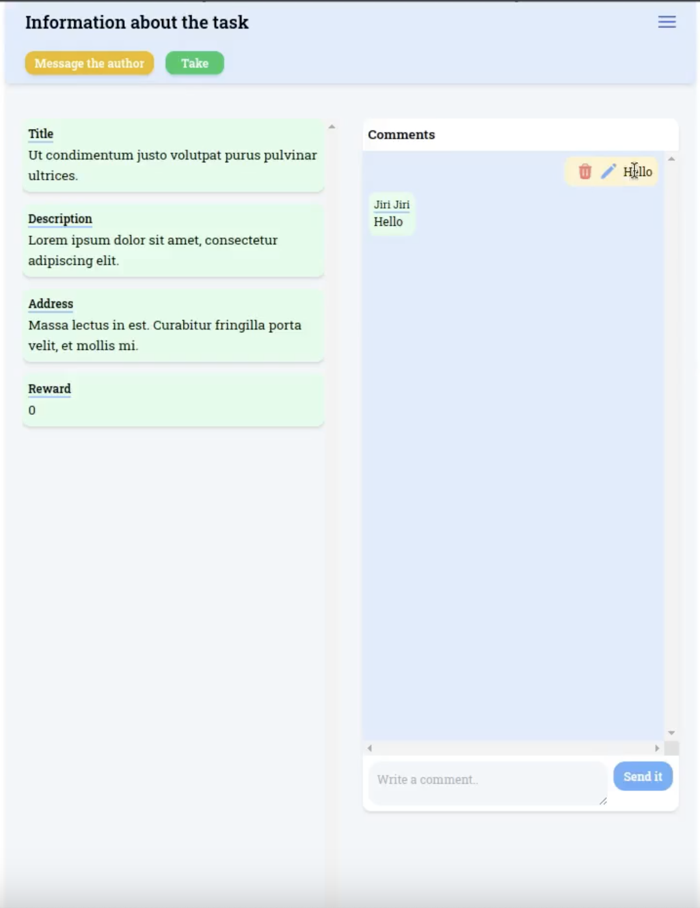
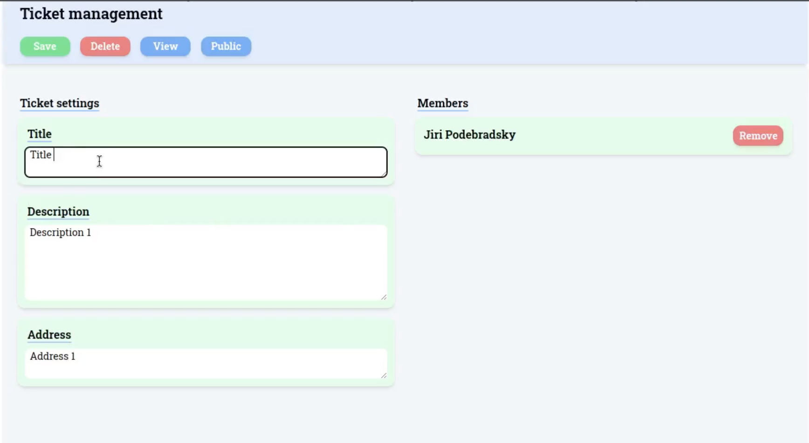
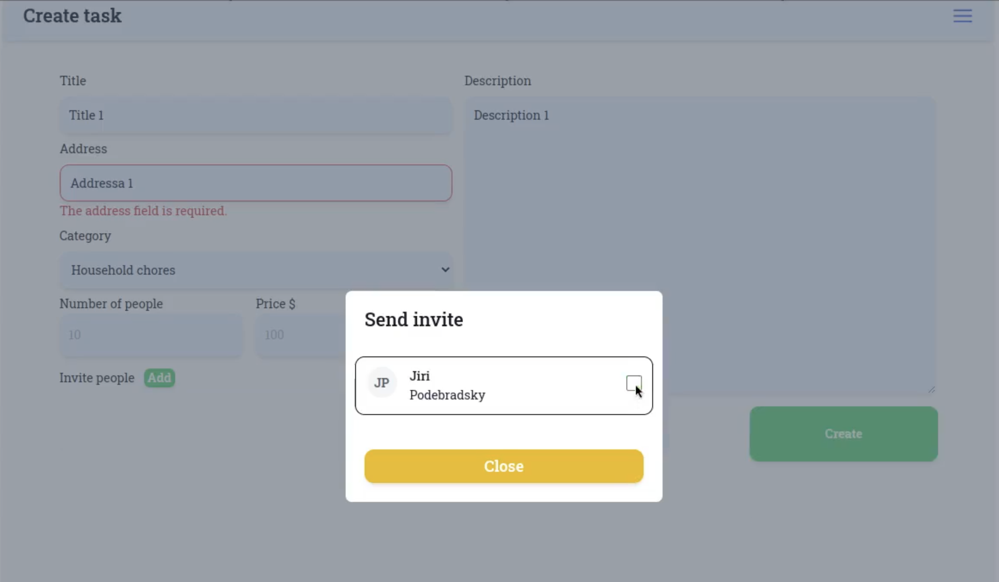

# Volunteers

**Author**: Vladislav Khrisanov, Vladislav Mikheda, Denis Karev

*This file contains a brief description of the application and the installation procedure.*

# Description
Dynamic web application designed to facilitate communication between volunteers and people in need. Users can either create tickets or respond to them. The application offers a wide range of features, including:

* Ticket handling and moderation system
* Public comments
* Private chat
* Interactive task boards for teams working on tasks
* Friend list
* Inviting friends to participate in tickets

# My work
My contributions include the development of a fully functional chat, comment system, task menus, and the implementation of various user roles across the application.







# Installation
Requirments: **PHP**, **Composer**, **MySql**.
Add your username, password and the database name to the `env` file.

Create new laravel project:
```bash
composer create-project laravel/laravel example-app
```
Copy the project files to the newly created project.

Module installation:
```bash
npm install
```
Database table creation:
```bash
php artisan migrate
```

Then run the following commands for the installation of required libraries:
```bash
composer require livewire/livewire
```
```bash
composer require blade-ui-kit/blade-icons
```
```bash
composer require blade-ui-kit/blade-heroicons
```
```bash
npm install -D tailwindcss
```
```bash
npx tailwindcss init
```

## Running the project

```bash
npm run dev
```

```bash
php artisan serve
```

## Signing in
The following credentials can be used to sign in: 

email: 1@user.cz  
password: 123    
  
email: 2@user.cz   
password: 123  
  
email: 3@user.cz  
password: 123  
